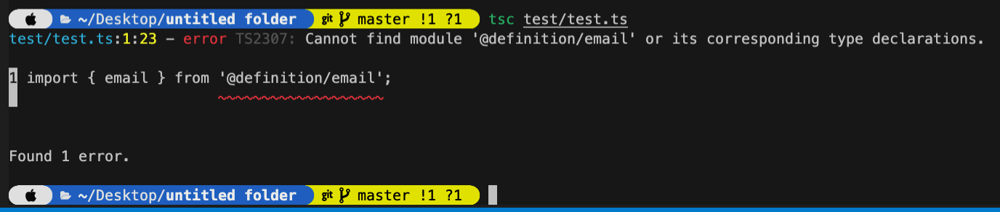

# TypeScript path mapping fail

想要用 Path mapping, 但 compile 的時候會跳錯誤

[test.ts](test/test.ts)  
[email.ts](definition/email.ts)

Ref: [Path Mapping](https://www.typescriptlang.org/docs/handbook/module-resolution.html#path-mapping)

 
